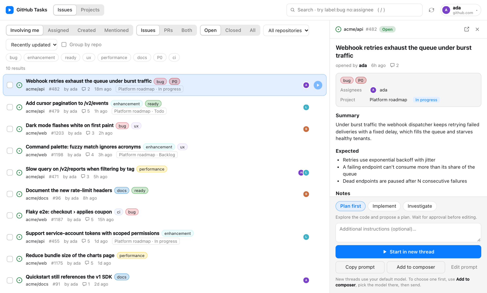
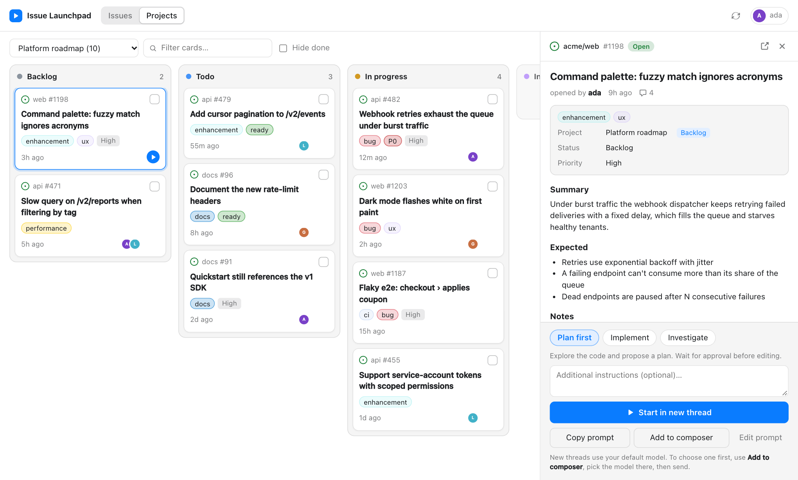
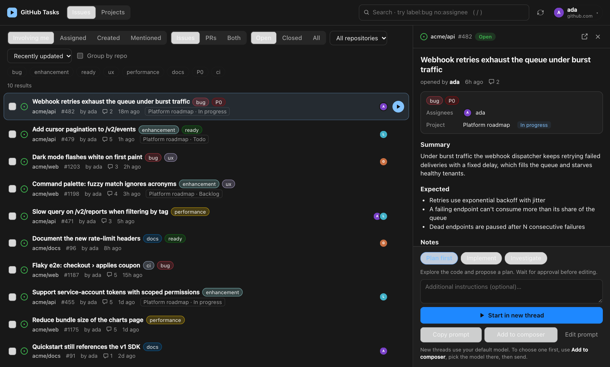

# Issue Launchpad

**A Codex / ChatGPT desktop plugin that turns your GitHub account into a task launchpad.**
Browse every issue you're involved in, see your GitHub Projects as boards, and start a Codex thread
on any of them in one click, pre-loaded with the issue, the repo and a plan-first or implement-now brief.



<details>
<summary>More screenshots (Projects board, dark mode)</summary>




</details>

> Screenshots use fake demo data (`DEMO=1 npm run dev`).

## Features

- **Issues across every repo.** Involving me / Assigned / Created / Mentioned, filtered by repo, label,
  state, issues vs PRs, optionally grouped by repo. The search box takes raw GitHub qualifiers
  (`label:bug no:assignee repo:owner/name`).
- **GitHub Projects (v2) as boards.** Every project you and your orgs can see, grouped by any
  single-select field (Status by default), with a card filter and "hide done".
- **One-click task kickoff.** Choose a mode, add notes, and **Start in new thread**:

  | Mode | What Codex is told to do |
  | --- | --- |
  | **Plan first** | Explore the code, propose a plan, wait for approval before editing |
  | **Implement** | Branch, change, test, open a PR that closes the issue |
  | **Investigate** | Find the root cause and report; no edits |
  | **Review** (PRs) | Review the diff and report findings by severity |

  The `▶` button on any row or card starts a thread immediately in your current mode.
- **Edit before you send.** *Edit prompt* shows the exact text Codex will receive. Edits are used by
  Start, Copy and Add to composer alike.
- **Pick a model first.** The extension API can't choose a model for a new thread (it uses your
  default). Use **Add to composer** to attach the prompt to the open composer, choose the model there,
  then send. Each attachment appears as its own removable chip titled with what it contains
  (e.g. `Plan first · acme/api#482 Webhook retries exhaust the…`), and adding more issues keeps the
  earlier ones. **Copy prompt** puts it on your clipboard.
- **Stays responsive while GitHub is slow.** Nothing blocks: saved results from your last visit show
  instantly and update in place (a thin progress bar and spinner show activity), filters and the board keep
  the old view on screen until fresh data lands, and hovering an issue pre-loads its details so opening
  it is instant.
- **Batch.** Tick several items to start one thread each, or attach them all to the composer.
- **Resizable detail panel** (drag the edge, double-click to reset, arrow keys to nudge; width is remembered).
- **Keyboard:** `j`/`k` move · `x` select · `/` search · `Esc` close.
- **Model tools.** Codex itself can call `launchpad.search`, `launchpad.projects` and `launchpad.issue`
  to read issues without leaving the conversation.

## Install

Requires the Codex desktop app and CLI, Node.js 22+, and a GitHub login (see [GitHub access](#github-access-one-time-setup)).

```sh
codex plugin marketplace add rafazafar/chatgpt-gh-issues-plugin
codex plugin add issue-launchpad@chatgpt-gh-issues-plugin
```

Fully quit and reopen the app, then choose **Issue Launchpad** in the sidebar.

Uninstall:

```sh
codex plugin remove issue-launchpad@chatgpt-gh-issues-plugin
codex plugin marketplace remove chatgpt-gh-issues-plugin
```

### GitHub access (one-time setup)

The plugin talks to GitHub's GraphQL API itself; the **GitHub CLI is only used to borrow your login**,
so you never paste a token. It finds credentials in this order:

1. `GITHUB_TOKEN` or `GH_TOKEN` in the environment of the Codex app, otherwise
2. your [GitHub CLI](https://cli.github.com) session (`gh auth token`). `gh` is looked up on `PATH` and
   in the usual install locations (`/opt/homebrew/bin`, `/usr/local/bin`, …), since desktop apps often
   start with a minimal `PATH`.

**Easiest path (recommended):**

```sh
brew install gh                 # or see https://cli.github.com
gh auth login
gh auth refresh -s project      # gh's default login has no Projects access
gh auth status                  # check: scopes should include repo, read:org, project
```

**Without the CLI:** create a [classic personal access token](https://github.com/settings/tokens) and make
it available to the app as `GITHUB_TOKEN`. Apps launched from the Dock don't see variables exported in
`~/.zshrc`, so start Codex from a terminal where it's set, or set it at the system level.

| Scope | Needed for |
| --- | --- |
| `repo` (or `public_repo` for public repos only) | Issues and PRs |
| `read:org` | Listing your orgs and their Projects |
| `project` or `read:project` | The Projects tab (Issues works without it) |

If your orgs enforce SAML SSO, authorise the token for them (GitHub → Settings → Tokens → Configure SSO).

### GitHub Enterprise

Works with **GitHub Enterprise Server** (`https://ghe.company.com`) and **GitHub Enterprise Cloud with data
residency** (`*.ghe.com`) as well as github.com.

```sh
gh auth login --hostname ghe.company.com
gh auth refresh -s project --hostname ghe.company.com
```

- The plugin reads the hosts you're signed in to from the GitHub CLI's `hosts.yml`. If you're signed in to more than
  one, a **host switcher** appears in the header. With a single Enterprise login it starts there automatically
  (set `GH_HOST` to force a default).
- Tokens are looked up **per host**: `GH_ENTERPRISE_TOKEN` (or `GITHUB_ENTERPRISE_TOKEN`) for Enterprise,
  `GITHUB_TOKEN`/`GH_TOKEN` for github.com. A github.com token is never sent to an Enterprise host (covered by a test).
- Prompts sent to Codex name the host and tell it to use `GH_HOST=<host>` with the `gh` CLI.
- Older Enterprise Server releases without some GraphQL fields (project membership, linked PRs) still list issues;
  those extras are simply left out. Projects v2 needs a server version that supports it.

> **Status:** the Enterprise path is covered by unit tests (endpoint selection, token isolation, host discovery,
> older-server fallback) but hasn't been run against a real Enterprise instance yet. Issues welcome if you hit
> something.

Requests go only to the GitHub host you're using (`api.github.com`, or your Enterprise host) plus avatar images. Nothing is
stored or sent anywhere else, and the plugin never writes to GitHub.

## How it works

Issue Launchpad is built on the [OpenAI MCP Extensions](https://github.com/openai/mcp-extensions)
([docs](https://developers.openai.com/plugins/build/extensions)): a local **MCP server** (stdio) that also
serves an **MCP App** UI.

| Piece | Where | Extension used |
| --- | --- | --- |
| Sidebar app + side-panel app | `launchpad.open`, `launchpad.tray` tools | `openai/ui` entrypoints: `global`, `thread` |
| Start a new thread | `src/app/host.ts` | `ui/message` with `target: "new"` |
| Add to composer | `src/app/host.ts` | `ui/update-model-context` + `_meta["openai/title"]` |
| GitHub data | `src/server/github.ts` | plain GraphQL over `fetch` (github.com + Enterprise) |
| Prompt templates | `src/app/prompt.ts` | n/a |

```
.agents/plugins/marketplace.json   marketplace manifest (repo root = marketplace)
plugins/issue-launchpad/           the built, installable plugin (committed so Git install works)
src/server/                        MCP server: tools, GitHub GraphQL client, demo fixtures
src/app/                           Preact UI, host bridge, prompt builder
.codex-plugin/ .mcp.json skills/   plugin manifest sources
scripts/build.mjs                  bundles server.js + a single self-contained app.html
scripts/dev.mjs                    standalone browser preview
```

## Development

```sh
npm install
npm test               # query builder, prompts, markdown sanitising
npm run typecheck
npm run build:plugin   # rebuild plugins/issue-launchpad (commit the result)
```

**Preview the UI in a browser** (no Codex needed, real GitHub data; "Start thread" copies the prompt):

```sh
npm run dev            # http://localhost:5199
DEMO=1 npm run dev     # fake data, no network
DEMO=1 LATENCY=3000 npm run dev   # simulate a slow GitHub to see the loading states
```

**Install your working copy into Codex** (after `npm run build:plugin`):

```sh
codex plugin marketplace add "$PWD"
codex plugin add issue-launchpad@chatgpt-gh-issues-plugin
```

Bump `version` in `.codex-plugin/plugin.json` when you change the plugin, then remove and re-add it so
Codex refreshes its cached copy.

## Troubleshooting

- **No sidebar entry:** run `codex plugin list` and check it says `installed, enabled`, then fully
  quit and reopen the app.
- **"No GitHub credentials found" / "gh isn't logged in":** run `gh auth login`, or provide `GITHUB_TOKEN`
  (see *GitHub access* above), then click refresh in the plugin.
- **Projects tab is empty:** run `gh auth refresh -s project` (add `--hostname <host>` for Enterprise). Org projects may also need SSO authorisation
  of your token.
- **Avatars don't show:** they're inlined by the server; check network access to `avatars.githubusercontent.com`.

## Limitations

- Read-only: you can't move cards or edit issues; the point is starting work.
- Boards load up to 300 items per project; issue search pages 40 at a time.
- A new thread uses your default model; see "Pick a model first" above.
- The installed MCP SDK has no per-tool `icons`, so the sidebar uses the server icon.

## Ideas

Composer `@`-mentions for issues, a settings page (default mode, prompt templates), a "which local
checkout is this repo" mapping so threads open in the right workspace.

## License

[Apache-2.0](LICENSE)
